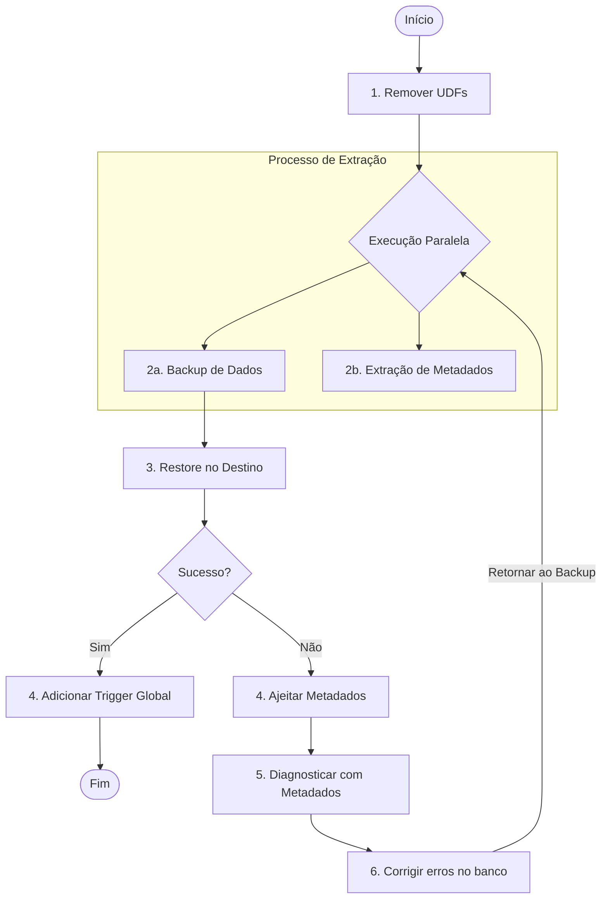

# Migração do 3.0 para o 5.0

Esse projeto é um framework que ajuda a acelerar a migração e outros processos do Firebird de modo organizado. Para poder utilizá-lo, você precisa das versões desejadas propriamente instaladas.

O funcionamento desse projeto depende na sua estrutura de diretórios que está melhor descrita na seção [Estrutura](#estrutura).

A principal configuração que deve ser feita antes de utilizar o projeto é atrelar os caminhos das instalações do Firebird na sua máquina. Isso é feito por meio do arquivo `config.json` dentro de cada diretório de versão do Firebird nesse projeto. Alguns caminhos padrão já estão definidos, mas eles podem ser diferentes na sua máquina, o que requer alterações.

## 🚶‍♂️ Passo a passo

Aqui está um passo a passo do que é necessário no processo de migração para o Firebird 5, para guia:



## 🗂 Estrutura

Abaixo está disponível as estruturas utilizadas por esse projeto para organizar o processo de migração. Primeiro é mostrado um exemplo de estrutura de entrada (o banco de origem) e depois de saída (o banco de destino).

```txt
firebird-v<versao>
└── <sistema>
    └── bancos
        └── <banco>
            ├── IN.FDB           (banco de origem)
            ├── metadados.sql    (ddl gerado do banco)
            ├── backup.fbk       (backup gerado do banco)
            └── backup.log       (log do backup)
```

```txt
firebird-v<versao>
└── <sistema>
    └── bancos
        └── <banco>
            ├── CLONE.FDB        (banco de teste criado com os metadados do banco de origem)
            ├── clone.log        (log da criação do banco de teste)
            ├── OUT.FDB          (banco de destino restaurado a partir de um backup)
            └── 📄 restore.log      (log da restauração do banco)
```

## 🩺 Diagnóstico de problemas

Para diagnosticar problemas na migração, esse projeto provê dois scripts:

- `extrair-metadados.ps1`: extrai todo o SQL que compõe a estrutura de um banco de origem
- `restaurar-metadados.ps1`: usa o SQL extraido para criar um novo banco na versão desejada, deixando um `.log` do processo com os erros encontrados, para que possam ser corrigidos diretamente no banco original

Alguns problemas existem com a extração do SQL, entretanto. O código gerado traz alguns identificadores do banco com nome "LOCAL" sem propriamente envolvê-los em aspas, como é necessário na versão 5. Para corrigir isso, ainda é necessária uma intervenção manual.

## ⛏ Refatoração dos metadados

Quando o `isql` gera os metadados do banco, há duas imperfeições que impedem o teste bem sucedido da clonagem na versão 5.0:

- O uso de `LOCAL` sem aspas
- O uso de `GRANT  ON` sem o tipo de permissão em `ALT_CUSTOMATPRIMA` e `LOTE`
